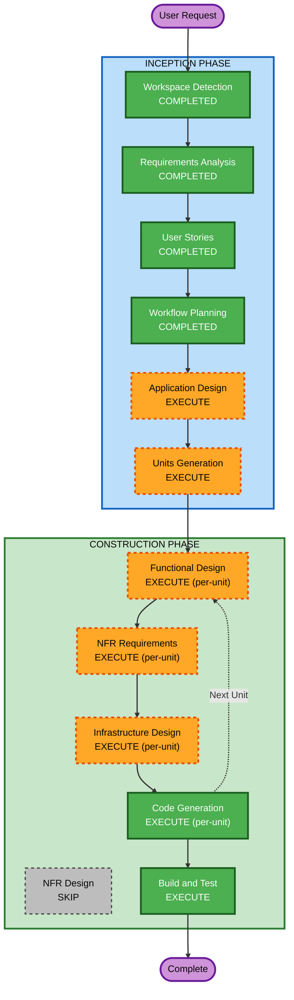

# Execution Plan

## Detailed Analysis Summary

### Change Impact Assessment
- **User-facing changes**: Yes — 고객 주문 UI, 관리자 대시보드 UI 신규 구축
- **Structural changes**: Yes — 전체 시스템 아키텍처 신규 설계 (React + Express + PostgreSQL)
- **Data model changes**: Yes — 매장, 테이블, 메뉴, 주문, 세션 등 전체 데이터 모델 신규
- **API changes**: Yes — RESTful API 전체 신규 설계
- **NFR impact**: Yes — SSE 실시간 통신, 동시 50명 접속, JWT 인증

### Risk Assessment
- **Risk Level**: Medium
- **Rollback Complexity**: Easy (그린필드 — 기존 시스템 없음)
- **Testing Complexity**: Moderate (SSE 실시간 통신, 세션 관리, 다중 매장 테스트 필요)

---

## Workflow Visualization



### Text Alternative
```
INCEPTION PHASE:
  1. Workspace Detection    — COMPLETED
  2. Requirements Analysis  — COMPLETED
  3. User Stories           — COMPLETED
  4. Workflow Planning      — COMPLETED
  5. Application Design     — EXECUTE
  6. Units Generation       — EXECUTE

CONSTRUCTION PHASE (per-unit loop):
  7. Functional Design      — EXECUTE
  8. NFR Requirements       — EXECUTE
  9. NFR Design             — SKIP
  10. Infrastructure Design — EXECUTE
  11. Code Generation       — EXECUTE
  12. Build and Test        — EXECUTE
```

---

## Phases to Execute

### INCEPTION PHASE
- [x] Workspace Detection (COMPLETED)
- [x] Requirements Analysis (COMPLETED)
- [x] User Stories (COMPLETED)
- [x] Workflow Planning (COMPLETED)
- [ ] Application Design — EXECUTE
  - **Rationale**: 신규 프로젝트로 컴포넌트 식별, 서비스 레이어 설계, 컴포넌트 간 의존성 정의 필요
- [ ] Units Generation — EXECUTE
  - **Rationale**: 고객 UI, 관리자 UI, 백엔드 API, 데이터베이스 등 다중 유닛으로 분해 필요

### CONSTRUCTION PHASE (per-unit)
- [ ] Functional Design — EXECUTE
  - **Rationale**: 데이터 모델, API 엔드포인트, 비즈니스 로직(주문 생성, 세션 관리, SSE) 상세 설계 필요
- [ ] NFR Requirements — EXECUTE
  - **Rationale**: 기술 스택 선정 확정, SSE 성능 요구사항, JWT 인증 설계, 동시 접속 50명 지원
- [ ] NFR Design — SKIP
  - **Rationale**: NFR Requirements에서 기술 스택과 패턴이 충분히 정의됨. 별도 NFR Design 단계 불필요 (그린필드 MVP)
- [ ] Infrastructure Design — EXECUTE
  - **Rationale**: AWS 배포 환경(EC2, RDS, S3) 매핑 필요
- [ ] Code Generation — EXECUTE (ALWAYS)
  - **Rationale**: 전체 애플리케이션 코드 생성
- [ ] Build and Test — EXECUTE (ALWAYS)
  - **Rationale**: 빌드 및 테스트 지침 생성

### OPERATIONS PHASE
- [ ] Operations — PLACEHOLDER

---

## Success Criteria
- **Primary Goal**: 다중 매장 지원 테이블오더 MVP 플랫폼 구축
- **Key Deliverables**:
  - React 기반 고객 주문 UI
  - React 기반 관리자 대시보드 UI
  - Node.js/Express 백엔드 API (SSE 포함)
  - PostgreSQL 데이터베이스 스키마
  - AWS 인프라 설계
  - PBT 포함 테스트 코드
- **Quality Gates**:
  - 모든 사용자 스토리 수용 기준 충족
  - INVEST 기준 준수
  - PBT 규칙 준수 (PBT-01 ~ PBT-10)
